Documentação rede inventário

Davi Bezerra November 2025

1 Inicio

Este laboratório é uma prática simplificada de um ambiente de redes com virtual box.

Equipamentos iniciais:

1. RouterOS versão Cloud Hosted Router VDI Image
1. Ubuntu Server 22.04 Iso Image
1. Alpine Linux VM version

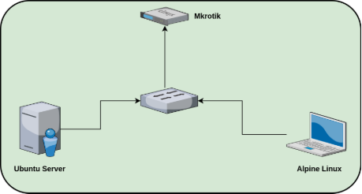

Figure 1: Cenário simplificado

1. Configuração Virtual Box

No virtual box, criamos uma rede host-only e adicionamos à VM do MikroTik uma interface adaptador NAT e uma interface adaptador host-only. A interface 2 (host-only) terá o endereço 192.168.56.1/24, enquanto a NAT recebe o IP 10.0.2.15/24 via DHCP VBox.

Essa configuração no MikroTik permite a conexão entre a rede host-only e a rede externa.

OBS: O adaptador NAT permite requisições para a internet pública de dentro para fora da rede, mas não o contrário.

2. Configuração de interfaces no MikroTik

Ao iniciar o RouterOS (MikroTik), verificamos se as interfaces foram reconhecidas com o comando interface print. A ether1 é a NAT e a ether2 é a Host-Only.

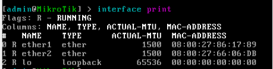

Figure 2: Interfaces MikroTik

Para adicionar um IP fixo na ether2, utilizamos o comando ip address add address=192.168.56.10/24 interface=ether2.

Podemos ver os endereços definidos com o comando ip address print:

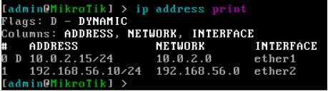

Figure 3: Endereços das interfaces

Com essas configurações, já conseguimos pingar da nossa máquina local para o MikroTik, e o MikroTik consegue pingar com sucesso para a internet pública. Outra configuração importante é a criação de uma regra de firewall para permissão de roteamento via MikroTik. O Ubuntu Server e o Alpine Linux terão o MikroTik como roteador (via 192.168.56.10/24). Então é necessário criar uma regra de NAT. Podemos usar a interface gráfica ou o comando de terminal /ip firewall nat add chain=srcnat out-interface=ether1 action=masquerade comment="NAT para LAN". Esse comando cria no firewall uma regra de nat para

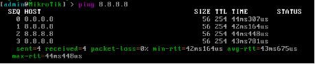

Figure 4: Ping para internet pública

permitir que os pacotes direcionados à internet pública passem pela interface ether1 (NAT) e sejam mascarados.

3. Configuração inicial de Ubuntu Server

No virtual box, adicionamos ao Ubuntu Server a interface host-only da subnet 192.168.56.0/24. Durante a instalação, definimos na interface as informações iniciais de rede. Para endereço IP, utilizamos o IP estático 192.168.56.5/24 e como gateway, inserimos o endereço do MikroTik 192.168.56.10. De início, para termos serviços funcionando, instalamos no servidor o OpenSSH e o Nginx. Opcionalmente, abrimos o arquivo etc/ssh/sshd_config e mudamos a porta padrão de 22 para 5347. Após, reiniciamos e habilitamos o serviço SSH.

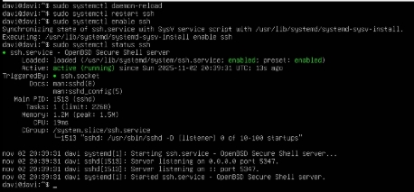

Figure 5: Serviço SSH

O servidor web Nginx servirá apenas para ter um outro serviço com porta disponível no servidor. Instalamos o mesmo com sudo apt update e sudo apt install nginx -y. Para confirmar que está tudo certo, podemos acessar o Ubuntu Server via SSH na nossa máquina local designando a porta modificada e dando um wget para verificar o funcionamento do servidor:

Por fim, instalamos e configuramos um servidor de arquivos Samba.

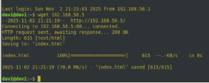

Figure 6: Confirmação de SSH e Nginx

4. Configuração inicial de cliente Alpine Linux

Ao instalar o Alpine Linux, inserimos também a interface Host-only e damos os comandos ip link para ver as interfaces. Nossa interface de interesse é a eth0, então inserimos ip addr add 192.168.56.6/24 dev eth0. Após isso, inserimos a rota para o MikroTik com ip route add default via 192.168.56.10. Esse método adiciona o endereço na interface temporariamente. Para fixar o endereço, editamos o arquivo /etc/network/interfaces e adicionamos o seguinte conteúdo:

auto eth0

iface eth0 inet static

address 192.168.56.6 netmask 255.255.255.0 gateway 192.168.56.10

2 Realização de Inventário

A máquina usada para a realização do inventário é a minha máquina host que está executando o virtual box. Por padrão, o Virtual Box cria uma interface virtual para conexão com a rede host only:

5: vboxnet0: <BROADCAST,MULTICAST,UP,LOWER_UP> mtu 1500 qdisc fq_codel state UP group default qlen 1000 link/ether 0a:00:27:00:00:00 brd ff:ff:ff:ff:ff:ff

inet 192.168.56.1/24 brd 192.168.56.255 scope global vboxnet0

Para esse laboratório, é interessante utilizarmos o endereço da interface virtual, que pode ser visto com ip route:

$ ip route

...

192.168.56.0/24 dev vboxnet0 proto kernel scope link src 192.168.56.1

Esse comando mostrou o endereço da interface virtual (192.168.56.1) e a sub-rede (192.168.56.0/24).

Para fazer o inventário básico e simples, podemos criar um Script Shell que gera um arquivo TXT com as informações obtidas e também um arquivo XML para visualização estruturada. Com um editor de texto (nano, vim, vi e etc) criamos o arquivo inventario.sh e inserimos esse conteúdo:

#!/bin/bash

NETWORK="192.168.56.0/24" OUT_TXT="inventario-rede.txt" OUT_XML="inventario-rede.xml"

sudo nmap -sS -T5 -p- -oN $OUT_TXT -oX $OUT_XML $NETWORK

Para executar temos que estar na mesma pasta e dar permissão de execução com sudo chmod +x inventario.sh. E então, usamos o comando ./inventario.sh. O script gerou os dois arquivos citados:

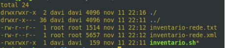

Figure 7: Diretório com arquivos

Ao abrir o arquivo TXT, temos as informações das máquinas da rede, com o 192.168.56.5 sendo o Ubuntu Server, o RouterOS MikroTik sendo o 192.168.56.10 e o Alpine Linux sendo o 192.168.56.6.

A seguir, abrimos o programa zenmap e inserimos a captura de rede do arquivo XML para obter as informações estruturadas e o mapa em forma de topologia. Além dessas informações, o zenmap mostra diversas outras, como portas, estados e outros detalhes, além de poder estruturar mais de acordo com a captura feita no arquivo XML.

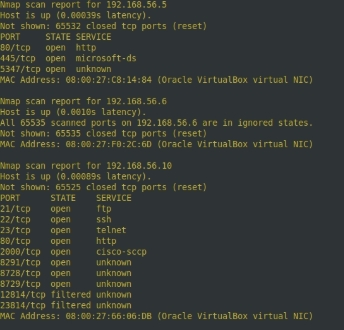

Figure 8: Captura em texto

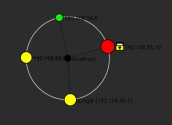

Figure 9: Topologia desenhada

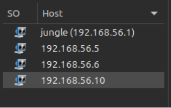

Figure 10: Máquinas registradas na captura

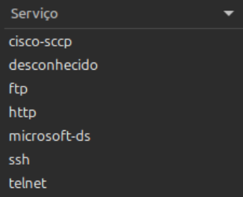

Figure 11: Serviços registrados na captura
7
